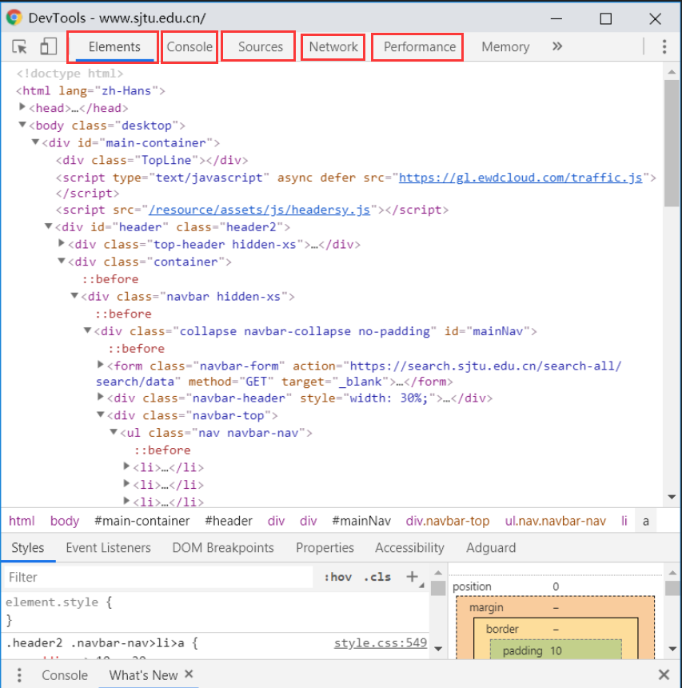
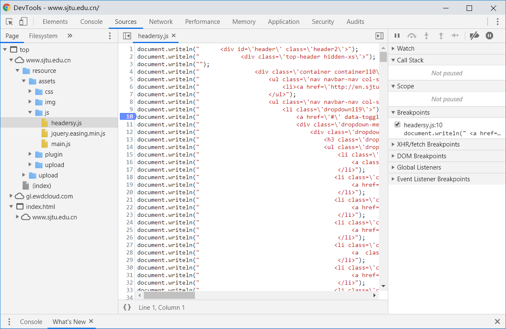
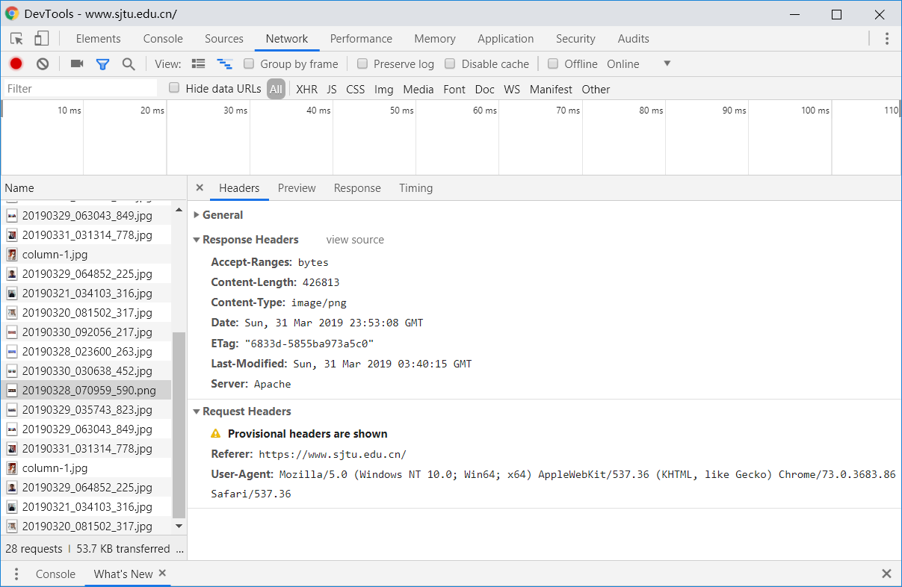

# Task Ⅰ

## 使用chrome的开发者工具

这就是在SJTU主页使用F12开发者工具之后的样子  

+ Element标签：该标签使用来查看页面的HTML标签元素的，能够也就是查看源码，我们可以看到布局，可以看到用到的样式，还有用到的链接等等。

+ console标签：这个就是一个web控制台。

+ sources标签：这个是显示资源文件的。

在source选项的视图中，可以选择资源文件，并且可以给js代码加上断点，看到行号上面有蓝色的标签，这个标签就是断点，当我们需要调试程序的时候打一个断点，然后通过右侧的工具栏进行调试。

+ Network标签：这个就是抓包常用的工具

那么这个页面就是用于抓包的页面，我们需要分析页面的请求，比如模拟登陆什么的都需要去分析程序是怎么在后台执行的。

## 我用清华大学的主页和SJTU的主页进行对比，可以发现

1. 清华大学主页的head标签里，篇幅很短，而SJTU主页的head中不仅有着这个网页制作公司 “东方网电子政务中心 上海东方怡动信息技术有限公司” 的名字，还有着几行被注释掉但未被删去的代码，篇幅显得较为冗余并且也会减慢网页的加载速度。其实这些多余的部分完全可以删去。

2. 主页的body部分。清华大学的body分为四部分：header、script、content和footer。各个块的功能很清晰。而SJTU主页的body有一个块，叫main-container，还有一个超链接，作用是可以跳转到页面的顶部（这个功能是清华大学的主页没有的。），还有着许多单行的script标签导入了许多js文件。在清华的主页中js文件是分别在各个块中导入的，这样显得代码结构更加清晰

3. 在SJTU的main-container中分了三个块，分别表示header，main content和footer，在每个div下面都有相应的注释，其实这个注释完全可以省略掉，因为在id中已经可以很清楚地表明这个块是干什么的。